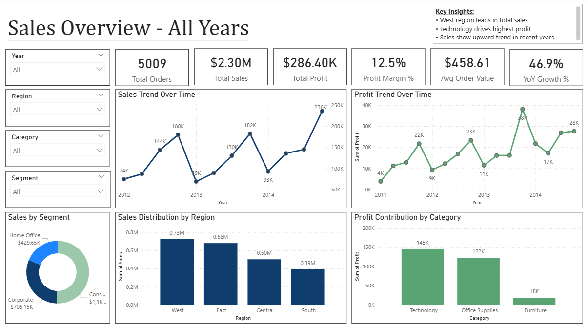
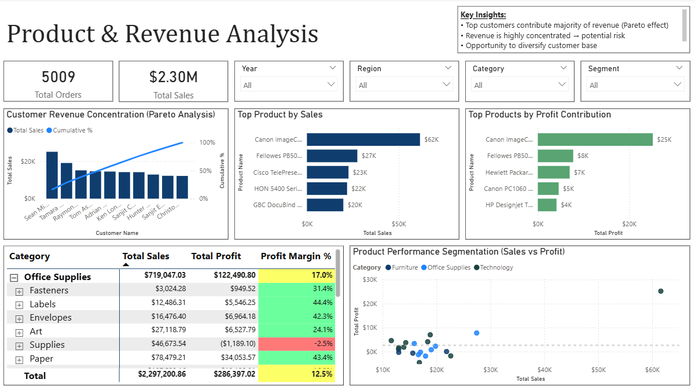

# 📊 Sales Analytics Dashboard (Power BI)
A Power BI dashboard analyzing sales performance, profitability, and product insights using DAX and star schema modeling.

## 📸 Dashboard Preview

---

## 📌 Overview
This project presents a Power BI dashboard analyzing sales performance, profitability, and product performance.

The dashboard is designed to provide actionable insights for business decision-making, including revenue trends, product performance, and customer revenue concentration.

--- 

## ❗ Problem Statement
Businesses often struggle to:
- Track sales and profit performance efficiently  
- Identify top-performing products and categories  
- Understand revenue concentration and associated risks
- 
---

## 🚀 Key Highlights
- Built a **2-page interactive Power BI dashboard**
- Designed a **star schema data model**
- Implemented **Pareto analysis (80/20 rule)** for revenue concentration
- Created **DAX measures** for KPIs and time-based analysis
- Applied **conditional formatting** to highlight profitability performance

---

## 🎯 Business Objectives
- Identify key drivers of revenue and profit  
- Analyze sales trends over time  
- Evaluate product and category performance  
- Assess revenue concentration and potential business risk  

---

## 📁 Dataset
- Superstore-style sales dataset (Excel format)

### Dataset Fields
- Sales, Profit, Quantity, Discount  
- Product, Category, Sub-Category  
- Customer, Segment, Region  
- Order Date, Ship Mode  

---

## ⚙️ Data Modeling
- Built a **star schema**:
  - Fact table: Sales transactions  
  - Dimension tables: Date, Product, Customer  

- Created DAX measures:
  - Total Sales  
  - Total Profit  
  - Profit Margin %  
  - Year-over-Year Growth  
  - Customer Ranking  
  - Cumulative Sales (Pareto analysis)  

---

## 📊 Dashboard Overview

### 🔹 Page 1: Sales Overview (Executive Dashboard)

#### Key Features
- KPI cards (Sales, Profit, Margin, YoY Growth)  
- Sales and Profit trends over time  
- Sales distribution by region  
- Profit contribution by category  
- Sales distribution by customer segment  

#### Key Insights
- Sales show a consistent upward trend over time  
- West region leads overall sales performance  
- Technology category is the primary profit driver  

---

### 🔹 Page 2: Product & Revenue Analysis

#### Key Features
- Pareto analysis of revenue concentration  
- Top-performing products by sales and profit  
- Product performance segmentation (Sales vs Profit scatter)  
- Profitability breakdown with conditional formatting  

#### Key Insights
- Revenue is concentrated among a small group of customers (Pareto effect)  
- High dependency on key revenue contributors indicates potential risk  
- Some high-sales products generate low profit, suggesting pricing or cost issues  

---

## 📈 Key Techniques Used
- DAX (time intelligence, ranking, cumulative calculations)  
- Data modeling (star schema design)  
- Conditional formatting for performance analysis  
- Pareto analysis (80/20 rule)  
- Scatter plot for product performance segmentation  

---

## 💡 Business Impact
This dashboard helps stakeholders:
- Monitor business performance at a glance  
- Identify high-performing and underperforming products  
- Understand revenue concentration risk  
- Support data-driven pricing and sales strategies  

---

## 🛠 Tools Used
- Power BI  
- DAX  
- Power Query  

---

## ▶️ How to Use
- Download and open `Sales_Profit_Dashboard.pbix` in Power BI Desktop  
- Use slicers to filter by year, region, category, and segment  
- Navigate between pages for overview and detailed analysis  

---

## 📂 Files Included
- `Sales_Profit_Dashboard.pbix` – Power BI dashboard file  
- `screenshots/page1.PNG` – Sales overview dashboard  
- `screenshots/page2.PNG` – Product & revenue analysis dashboard  
- `data/superstore.xlsx` – Source dataset  

---

## 📬 Contact
Feel free to connect if you have feedback or opportunities!
